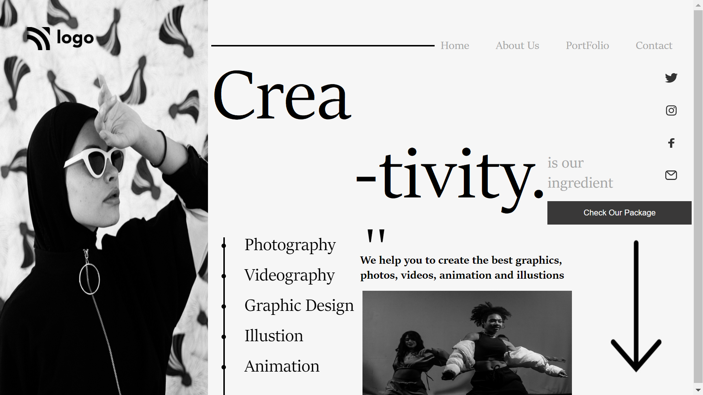

# ASSIGNMENT 14 USING HTML AND CSS

## NAME : NIRAJ VADHER 

In this project I was given the task to make a home page which should look like this

### Target:

### Result:

`ZOOM:67%`
## Learning
In this project i get to learn many thing like
- how to add navigation bar using flex
- how to use background effectively
- how to align items using flex
- Positioning was the main task of this assignment and using flex it was very easy to position.
## Honest Time of compeletion of project
- `2 hours`

## Live link of project
 - [PROJECT 14](https://tempproject14.netlify.app/)